# 🔄 GCP Delta Ingestion Framework — Architecture Comparison Report

> **Raw → Staging → Curation Pipeline** | BigQuery | Google Cloud Platform | March 2026

---

## 📌 Problem Statement

The framework must:
1. **Detect** delta records between the Raw layer and Staging layer (same table schema, both in BigQuery)
2. **Ingest** delta records into the Staging table as a new partition
3. **Flag** the new partition as unprocessed in a metadata table
4. **Pick up** unprocessed partitions, apply transformation logic
5. **Load** transformed data into the Curation layer

---

## 🗂️ Quick Navigation

| # | Approach | Best For | Complexity |
|---|----------|----------|------------|
| [1](#approach-1--bigquery-native-sql) | BigQuery Native SQL | < 100 GB batch loads | 🟢 Low |
| [2](#approach-2--apache-beam--dataflow) | Apache Beam / Dataflow | Streaming CDC, any scale | 🟡 Medium |
| [3](#approach-3--cloud-composer-managed-airflow) | Cloud Composer (Airflow) | Enterprise orchestration | 🟡 Medium |
| [4](#approach-4--cloud-functions--bigquery) | Cloud Functions + BigQuery | Event-driven micro loads | 🟢 Low |
| [5](#approach-5--dataproc-apache-spark) | Dataproc (Apache Spark) | > 500 GB batch, Spark teams | 🔴 High |
| [6](#approach-6--composer--ephemeral-dataproc--spark--dataplex--observability-dashboard) | Composer + Ephemeral Dataproc + Dataplex + Dashboard | Month-end batch, zero idle cost, governance + full observability | 🟡 Medium |
| [C](#comparison-report) | 📊 Comparison Report | All approaches side-by-side | — |

---

## 🔑 Delta Detection: Core Techniques

Before diving into approaches, these are the fundamental delta detection strategies used across all architectures.

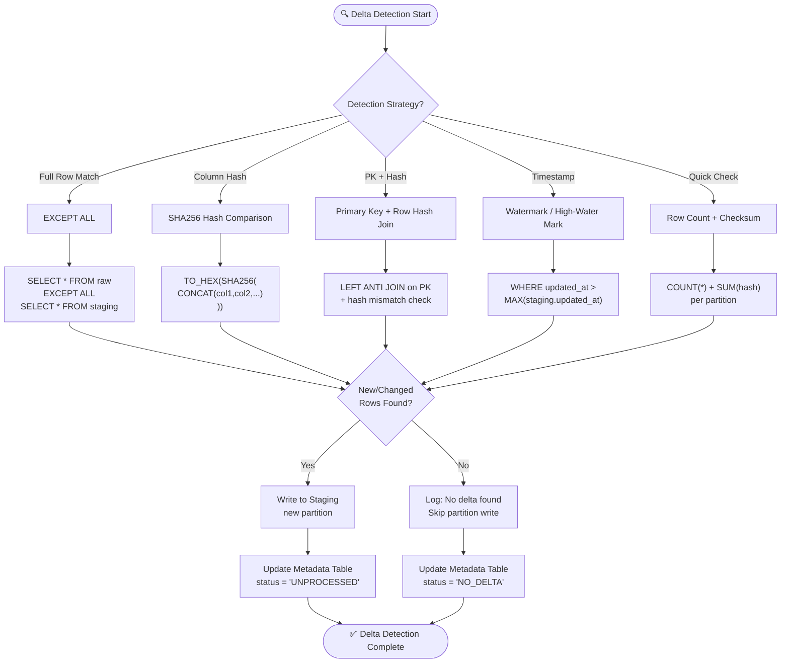

### SHA256 Hash Delta Detection — Deep Dive

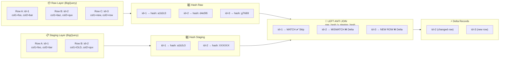

---

---

## Approach 1 — BigQuery Native SQL

<div align="center">

### 🏗️ Technology Stack


</div>

### 📐 High-Level Architecture

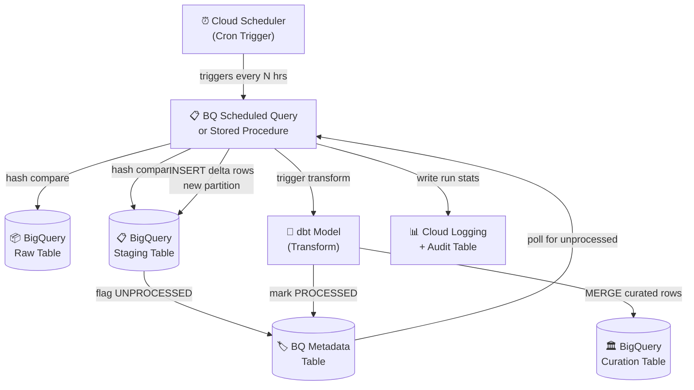

### 🔄 Delta Detection & Pipeline Flow

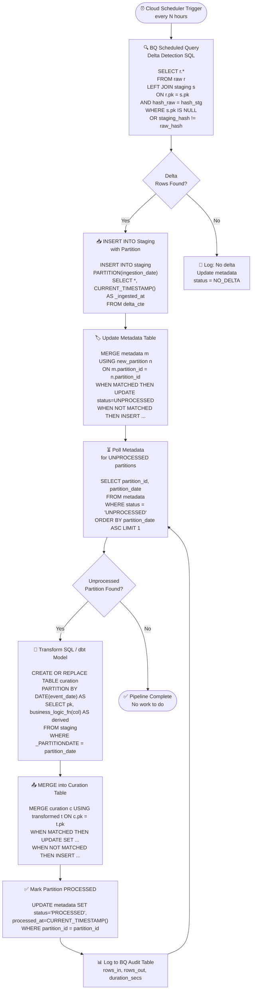

### 🧩 Component List

| Component | GCP Service | Purpose | Config Detail |
|-----------|-------------|---------|---------------|
| **Raw Table** | BigQuery | Source of truth, append-only | Partitioned by `ingestion_date`, clustered by PK |
| **Staging Table** | BigQuery | Delta-detected records, pre-transform | Partitioned by `ingestion_date`, same schema as Raw |
| **Curation Table** | BigQuery | Transformed, business-ready data | Partitioned by `event_date`, enriched schema |
| **Metadata Table** | BigQuery | Tracks partition status | Cols: `partition_id`, `status`, `row_count`, `ingested_at`, `processed_at` |
| **Delta Query** | BQ Scheduled Query / Stored Proc | SHA256 hash comparison + INSERT | Runs via Cloud Scheduler trigger |
| **Transform Logic** | BQ Stored Procedure / dbt | Business logic application | dbt model reads from staging partition |
| **Scheduler** | Cloud Scheduler | Trigger delta detection runs | Cron: `0 */4 * * *` (every 4 hrs) |
| **Logging** | Cloud Logging + BQ Audit | Pipeline run observability | Writes to `audit.pipeline_runs` table |

### ✅ Pros & ❌ Cons

| | Detail |
|--|--------|
| ✅ **Zero Infrastructure** | No servers, no clusters — pure managed SQL |
| ✅ **Lowest Cost** | Pay only for bytes scanned; no idle compute |
| ✅ **Native BQ Integration** | MERGE, EXCEPT, SHA256, partition decorators all built-in |
| ✅ **Easy Partition Writes** | `INSERT INTO table PARTITION(date=X)` is natively supported |
| ✅ **Fast Deployment** | SQL + scheduler = production in hours |
| ✅ **dbt Compatible** | Transform step maps perfectly to dbt models |
| ❌ **SQL Only** | Cannot run Python, custom UDFs with complexity, ML inference inline |
| ❌ **No Native Orchestration** | Dependencies, retries, branching are hard in SQL alone |
| ❌ **Large Table Costs** | Full-table hash comparison on 500GB+ gets expensive fast |
| ❌ **No Streaming** | Scheduled queries are batch-only; min latency ~15 minutes |
| ❌ **INFORMATION_SCHEMA Polling** | Detecting new raw partitions via INFORMATION_SCHEMA adds slot usage |
| ❌ **Error Handling Limited** | No dead-letter queue without custom BQ tables + Cloud Functions |

---

---

## Approach 2 — Apache Beam / Dataflow

<div align="center">

### 🏗️ Technology Stack


</div>

### 📐 High-Level Architecture

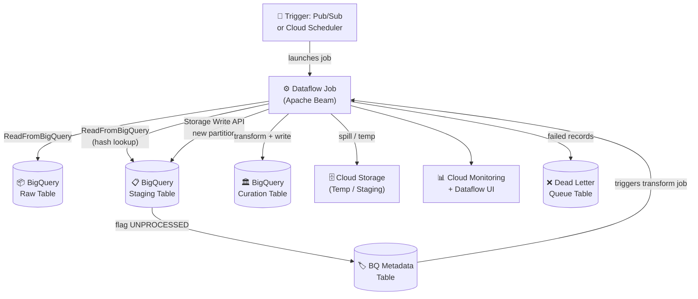

### 🔄 Delta Detection & Pipeline Flow

```mermaid
flowchart TD
    A([" 📨 Trigger: Pub/Sub Message
or GCS File Arrival
or Scheduled Job"]) --> B

    B["🚀 Launch Dataflow Job
Apache Beam Python Pipeline"]

    B --> C

    subgraph BEAM[" ⚙️ Apache Beam Pipeline on Dataflow Workers"]
        C["📖 Read Raw Table
beam.io.ReadFromBigQuery

SELECT *, TO_HEX(SHA256(
  CONCAT(CAST(col1 AS STRING), ...)
)) AS row_hash
FROM raw_table"]

        C --> D["📖 Read Staging Hashes
beam.io.ReadFromBigQuery

SELECT pk, row_hash FROM staging
WHERE _PARTITIONDATE >= lookback_date"]

        D --> E["🔗 CoGroupByKey Join on PK

KeyedRaw = raw | Map(lambda r: (r.pk, r))
KeyedStg = stg | Map(lambda s: (s.pk, s))
Grouped  = (KeyedRaw, KeyedStg)
           | CoGroupByKey"]

        E --> F["🔍 DeltaDetectionDoFn

for pk, (raw_rows, stg_rows) in grouped:
  if not stg_rows:           # NEW row
    yield element
  elif raw_hash != stg_hash: # CHANGED row
    yield element
  # else: MATCH — skip"]

        F --> G["🏷️ Annotate Delta Records
Add metadata fields:
  _delta_type: NEW / CHANGED
  _detected_at: timestamp
  _source_partition: date
  _pipeline_run_id: uuid"]
    end

    G --> H["📥 Write to Staging Partition
beam.io.WriteToBigQuery

method = STORAGE_WRITE_API
write_disposition = WRITE_APPEND
partition_decorator = staging:date"]

    H --> I["🏷️ Update Metadata Table
Beam side output insert
status = UNPROCESSED"]

    I --> J["⏳ Watch Metadata
for UNPROCESSED partition"]

    J --> K["🔧 Launch Transform Dataflow Job
Read staging partition
Apply business logic
Enrich, clean, derive fields"]

    K --> L["📤 Write to Curation
Storage Write API + partition decorator"]

    L --> M["✅ Mark Partition PROCESSED
Insert audit row"]
```

### 🧩 Component List

| Component | GCP Service | Purpose | Config Detail |
|-----------|-------------|---------|---------------|
| **Trigger Source** | Pub/Sub | Fire pipeline on new raw data | CDC events or scheduled publish |
| **Dataflow Job** | Cloud Dataflow | Execute Beam pipeline | Runner: DataflowRunner, auto-scaling enabled |
| **Delta DoFn** | Apache Beam (Python) | CoGroupByKey hash comparison | Custom `DeltaDetectionDoFn` with side output |
| **Staging Writer** | BQ Storage Write API | Exactly-once write to staging partition | COMMITTED mode, partition decorator |
| **Transform Job** | Dataflow (2nd job) | Apply business logic | Reads from staging, writes to curation |
| **Metadata Table** | BigQuery | Partition status tracking | Written via Beam side output |
| **Temp Bucket** | Cloud Storage | Beam job temp files | Auto-created per job run |
| **Cloud Monitoring** | GCP Monitoring | Job health, throughput metrics | Custom metrics via `beam.metrics` |
| **Dead Letter Table** | BigQuery | Failed record capture | Side output to `dlq_table` |

### ✅ Pros & ❌ Cons

| | Detail |
|--|--------|
| ✅ **Auto-Scaling** | Dataflow scales workers horizontally to match data volume |
| ✅ **Exactly-Once Semantics** | Storage Write API COMMITTED mode guarantees no duplicates |
| ✅ **Streaming Support** | Can run in streaming mode for near-real-time delta (< 2 min latency) |
| ✅ **Backpressure Handling** | Beam windowing absorbs load spikes naturally |
| ✅ **Managed Infrastructure** | No cluster management — Dataflow handles worker lifecycle |
| ✅ **Rich Python/Java SDK** | Complex transform logic in familiar language |
| ✅ **Deep GCP Integration** | Native connectors: BQ, GCS, Pub/Sub, Bigtable |
| ❌ **Higher Cost at Low Volume** | Minimum worker spin-up cost; not efficient for < 1 GB loads |
| ❌ **Job Startup Latency** | 2–4 minutes cold start before first record processed |
| ❌ **Steep Beam Learning Curve** | CoGroupByKey, windowing, triggers — complex API |
| ❌ **No Built-in Orchestration** | Needs external trigger (Composer/Scheduler) to chain jobs |
| ❌ **Debugging Complexity** | Distributed traces; Dataflow UI not as intuitive as Airflow |
| ❌ **Over-engineered for Simple Batch** | CQRS-style pipelines are overkill for nightly 10 GB loads |

---

---

## Approach 3 — Cloud Composer (Managed Airflow)

<div align="center">

### 🏗️ Technology Stack


</div>

### 📐 High-Level Architecture

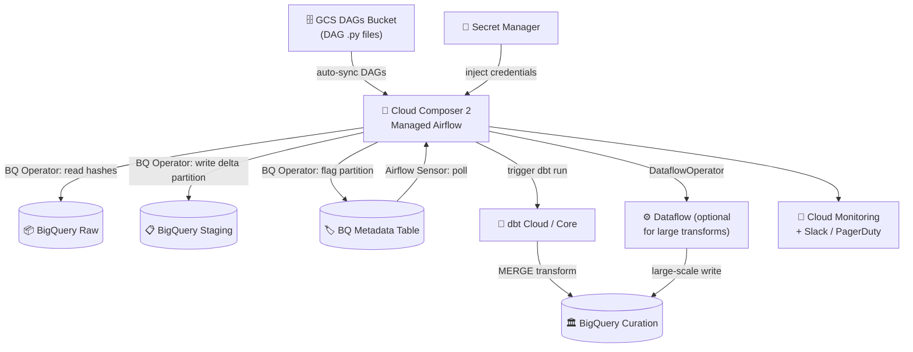

### 🔄 DAG Pipeline Flow (Airflow)

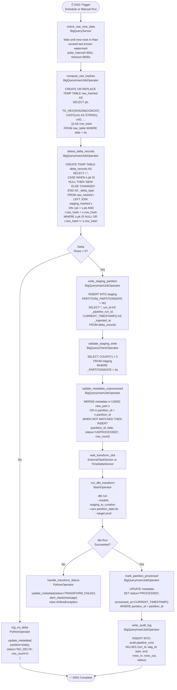

### 🧩 Component List

| Component | GCP / Tool | Purpose | Config Detail |
|-----------|------------|---------|---------------|
| **Cloud Composer 2** | Cloud Composer | DAG orchestration engine | `composer-2-large`, autoscaling workers |
| **DAGs Bucket** | Cloud Storage | DAG Python files, dbt project | Auto-synced to Composer workers |
| **BigQuerySensor** | Airflow Operator | Wait for new raw data | Polls `INFORMATION_SCHEMA` or metadata table |
| **BigQueryInsertJobOperator** | Airflow Operator | Run SQL (delta detect, write, validate) | Async mode, uses BQ job API |
| **BigQueryCheckOperator** | Airflow Operator | Data quality gate after write | Fails DAG if count = 0 |
| **dbt Operator** | Bash / dbt Cloud | Transform staging to curation | dbt models parameterized by partition date |
| **Metadata Table** | BigQuery | Partition lifecycle tracking | `audit.partition_metadata` table |
| **Audit Log Table** | BigQuery | Full pipeline run history | `audit.pipeline_runs` table |
| **Cloud Monitoring** | GCP Monitoring | DAG SLA alerts, failure notifications | Integrated with Airflow alerting hooks |
| **Secret Manager** | Secret Manager | BQ credentials, dbt tokens | Accessed via Airflow GCP backends |

### ✅ Pros & ❌ Cons

| | Detail |
|--|--------|
| ✅ **Full Orchestration** | DAG tasks with dependencies, retries, SLA, branching — enterprise-grade |
| ✅ **Built-in Observability** | Airflow UI: task logs, Gantt chart, DAG history, XCom values |
| ✅ **Retry & Alerting** | `retries=3`, `retry_delay`, `on_failure_callback` to Slack/PagerDuty |
| ✅ **Natural Staging→Curation Flow** | Multi-step DAG is a perfect fit for partition-aware pipelines |
| ✅ **dbt Native Integration** | dbt + Airflow is an industry-standard data engineering stack |
| ✅ **Audit & Lineage** | XCom + BQ audit table gives complete run history |
| ✅ **Handles Complex Logic** | PythonOperator for anything not possible in SQL |
| ❌ **High Fixed Cost** | Composer 2 environment ~$300–800/month even at idle |
| ❌ **Operational Overhead** | Composer upgrades, worker scaling, GKE pod management |
| ❌ **Cold Start** | DAG parsing + worker pod spin-up adds 1–3 min latency |
| ❌ **Overkill for Single Tables** | Airflow setup cost not justified for 1-2 table pipelines |
| ❌ **Airflow Expertise Required** | DAG writing, XCom, sensors, custom operators need specialist knowledge |
| ❌ **Not Serverless** | Always-on GKE cluster; no true scale-to-zero |

---

---

## Approach 4 — Cloud Functions + BigQuery

<div align="center">

### 🏗️ Technology Stack


</div>

### 📐 High-Level Architecture

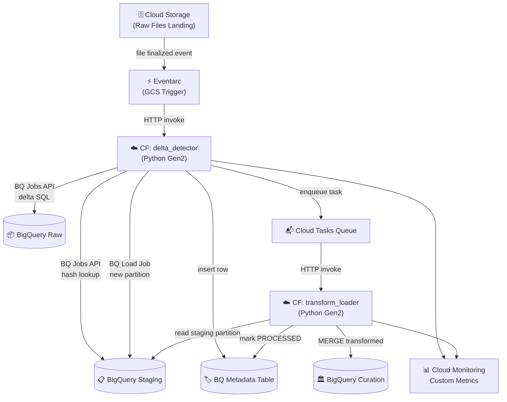

### 🔄 Delta Detection & Pipeline Flow

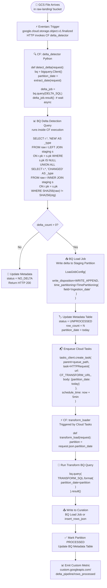

### 🧩 Component List

| Component | GCP Service | Purpose | Config Detail |
|-----------|-------------|---------|---------------|
| **Event Trigger** | Eventarc | Fire function on GCS file arrival | `google.cloud.storage.object.v1.finalized` |
| **CF: delta_detector** | Cloud Functions Gen 2 | Detect delta via BQ Jobs API | Python 3.11, 2 GB RAM, 540s timeout |
| **CF: transform_loader** | Cloud Functions Gen 2 | Apply transforms, load to curation | Python 3.11, 2 GB RAM, 540s timeout |
| **BQ Jobs API** | BigQuery | Run delta SQL and transform SQL | Async job polling with `result()` |
| **Cloud Tasks** | Cloud Tasks | Decouple delta detect to transform | Queue with rate limiting + retries |
| **Metadata Table** | BigQuery | Partition lifecycle tracking | Written directly via `insert_rows_json` |
| **BQ Load Job** | BigQuery | Write delta rows to staging partition | `TimePartitioning(field='ingestion_date')` |
| **Secret Manager** | Secret Manager | Store BQ credentials, API keys | `secretmanager.SecretManagerServiceClient` |
| **Cloud Monitoring** | GCP Monitoring | Custom metrics, uptime checks | `google-cloud-monitoring` Python client |

### ✅ Pros & ❌ Cons

| | Detail |
|--|--------|
| ✅ **Fully Serverless** | Zero idle cost — pay only per invocation (first 2M free per month) |
| ✅ **Event-Driven** | Triggers instantly on GCS file arrival or Pub/Sub message |
| ✅ **Fast to Deploy** | Production-ready in hours; no infra to provision |
| ✅ **Auto-Scales to Zero** | No running cost when no files arrive |
| ✅ **Simple Python Code** | BQ Python client is well-documented and easy to use |
| ✅ **Natural for File-Based Loads** | GCS Eventarc CF is the canonical serverless ingest pattern |
| ❌ **Execution Timeout** | CF Gen 2 max is 60 min but entire BQ job must complete within that |
| ❌ **No Built-in Orchestration** | Must manually chain functions via Cloud Tasks or Pub/Sub |
| ❌ **Memory & CPU Limits** | Max 16 GB RAM, 4 vCPU — not for in-memory large dataset transforms |
| ❌ **Complex Multi-Step Pipelines** | 5+ step pipelines become unmaintainable without an orchestrator |
| ❌ **Cold Start Latency** | First invocation adds 1–3s delay |
| ❌ **Hard to Monitor End-to-End** | No single pane for pipeline status; need custom Monitoring dashboards |

---

---

## Approach 5 — Dataproc (Apache Spark)

<div align="center">

### 🏗️ Technology Stack


</div>

### 📐 High-Level Architecture

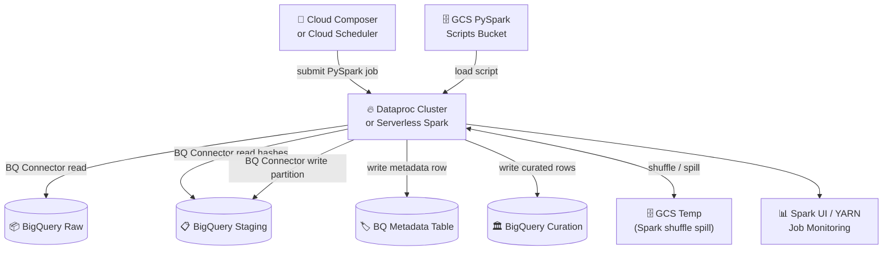

### 🔄 Delta Detection & Pipeline Flow

```mermaid
flowchart TD
    A([" ⏰ Trigger: Composer DAG
or gcloud CLI"]) --> B

    B["🚀 Submit Dataproc Job

gcloud dataproc jobs submit pyspark
  --cluster=delta-cluster
  --region=us-central1
  gs://bucket/scripts/delta_ingest.py
  -- --date=2026-03-03"]

    B --> C

    subgraph SPARK[" ⚙️ PySpark Job Running on Dataproc Workers"]
        C["📖 Read Raw Table
BigQuery Connector

raw_df = spark.read
  .format('bigquery')
  .option('table', 'project.raw.table')
  .option('filter', f'ingestion_date={date}')
  .load()"]

        C --> D["📖 Read Staging Hashes
Hash columns only for efficiency

stg_df = spark.read
  .format('bigquery')
  .option('table', 'project.staging.table')
  .load()
  .select('pk', 'row_hash')"]

        D --> E["#️⃣ Compute Row Hashes

from pyspark.sql.functions import sha2, concat_ws

hashed_raw = raw_df.withColumn(
  'row_hash',
  sha2(concat_ws('|', *value_cols), 256)
)"]

        E --> F["🔍 NEW Rows Detection
Left Anti Join

new_rows = hashed_raw.join(
  stg_df, on='pk', how='left_anti'
).withColumn('_delta_type', lit('NEW'))"]

        F --> G["🔍 CHANGED Rows Detection
Inner Join + Hash Mismatch

changed_rows = hashed_raw.join(
  stg_df, on='pk', how='inner'
).filter(
  hashed_raw.row_hash != stg_df.row_hash
).withColumn('_delta_type', lit('CHANGED'))"]

        G --> H["🔗 Union All Delta Records

delta_df = new_rows.union(changed_rows)
  .withColumn('_ingested_at', current_timestamp())
  .withColumn('_partition_date', lit(date))"]
    end

    H --> I{delta_df
count > 0?}

    I -->|No| J["📝 Write metadata: NO_DELTA
stop job successfully"]

    I -->|Yes| K["📥 Write to Staging Partition

delta_df.write
  .format('bigquery')
  .option('table', 'project.staging.table')
  .option('temporaryGcsBucket', temp_bucket)
  .option('partitionField', 'ingestion_date')
  .option('partitionType', 'DAY')
  .mode('append')
  .save()"]

    K --> L["🏷️ Update Metadata
Write directly to BQ via Spark

metadata_df.write
  .format('bigquery')
  .option('table', 'project.audit.metadata')
  .mode('append').save()"]

    L --> M["🔧 Transform Stage
Spark SQL Transformation

curated_df = spark.sql('''
  SELECT pk,
    TRIM(col1) AS col1_clean,
    business_fn(col2) AS col2_derived,
    CURRENT_TIMESTAMP() AS processed_at
  FROM staging_view
  WHERE _partition_date = date
''')"]

    M --> N["📤 Write to Curation

curated_df.write
  .format('bigquery')
  .option('table', 'project.curation.table')
  .option('partitionField', 'event_date')
  .mode('overwrite')
  .save()"]

    N --> O["✅ Mark Partition PROCESSED
Update BQ Metadata Table"]
```

### 🧩 Component List

| Component | GCP Service | Purpose | Config Detail |
|-----------|-------------|---------|---------------|
| **Dataproc Cluster** | Cloud Dataproc | Execute PySpark jobs | `n1-standard-8` workers, Preemptible VMs for cost |
| **Dataproc Serverless** | Cloud Dataproc | Serverless Spark (no cluster mgmt) | `gcloud dataproc batches submit pyspark` |
| **BQ Connector** | Spark-BigQuery Connector | Read/write BigQuery from Spark | `com.google.cloud.spark:spark-bigquery-with-dependencies` |
| **GCS Temp Bucket** | Cloud Storage | Spark shuffle / temp spill | Auto-managed by Spark |
| **PySpark Script** | GCS | Delta detection + transform code | Stored in `gs://bucket/scripts/` |
| **Metadata Table** | BigQuery | Partition status tracking | Written via BQ Spark connector |
| **Dataproc Autoscaling** | Dataproc | Dynamic worker count | Policy: min=2, max=20 workers |
| **Cloud Composer (optional)** | Cloud Composer | Trigger and monitor Dataproc job | `DataprocSubmitJobOperator` |
| **Spark UI / YARN** | Dataproc Web UI | Job monitoring, stage details | Accessible via Cloud Dataproc console |

### ✅ Pros & ❌ Cons

| | Detail |
|--|--------|
| ✅ **Massive Scale** | Handles 500 GB–10 TB+ delta detection with distributed Spark join |
| ✅ **DataFrame API** | Rich Spark SQL + DataFrame API for complex transform logic |
| ✅ **Preemptible VMs** | 60–80% cost reduction using spot/preemptible workers |
| ✅ **Spark Ecosystem** | Delta Lake, Apache Iceberg, MLlib, GraphX all available |
| ✅ **Left Anti Join** | The most efficient pattern for large-scale delta detection |
| ✅ **Familiar for Migrating Teams** | Direct Hive/on-prem Spark migration path |
| ❌ **Cluster Startup: 3–5 min** | Cold cluster adds significant latency to every run |
| ❌ **Expensive for Small Jobs** | Minimum cluster cost even for a 1 GB delta |
| ❌ **BQ Connector Overhead** | Serialization between Spark and BQ adds I/O latency |
| ❌ **Cluster Management** | Version upgrades, init scripts, autoscaling policies need tuning |
| ❌ **Requires Spark Expertise** | Not every team has PySpark + BQ connector experience |
| ❌ **GCS Temp Bucket Required** | Spark-BQ writes always go through GCS temp — adds cost and steps |

---

---

## Approach 6 — Composer + Ephemeral Dataproc + Spark + Dataplex + Observability Dashboard

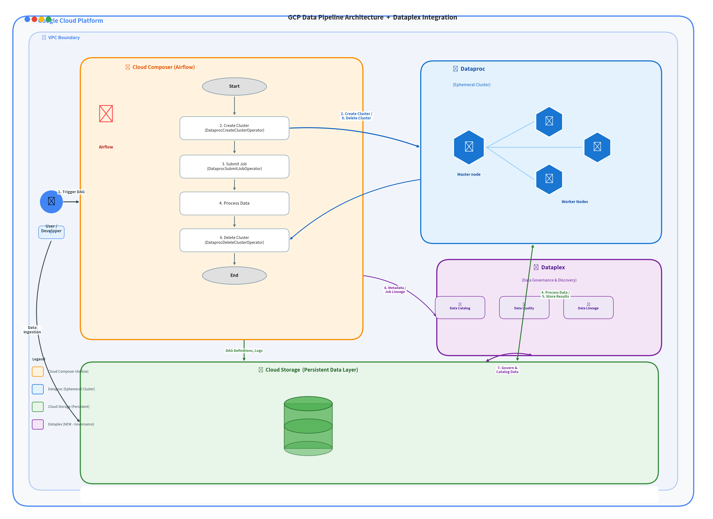

<div align="center">

### 🏗️ Technology Stack


</div>

> **Design Intent:** Cloud Composer is scheduled on the **last day of every month**. On trigger, it spins up a fresh ephemeral Dataproc cluster, submits a PySpark job that reads the BigQuery raw table, compares with staging using SHA256 hash, detects delta records, and loads them into the staging table as a new partition. The cluster is immediately destroyed after the job completes. **Dataplex** sits as a unified governance layer across all three BQ layers — it organises Raw, Staging, and Curation tables into Lakes and Zones, auto-discovers metadata, runs automated Data Quality scans after every partition write, tracks end-to-end data lineage, and enforces zone-level IAM policies. A live Looker Studio dashboard reads from BQ audit tables (including Dataplex DQ results) and provides full pipeline observability.

---

### 📐 High-Level Architecture

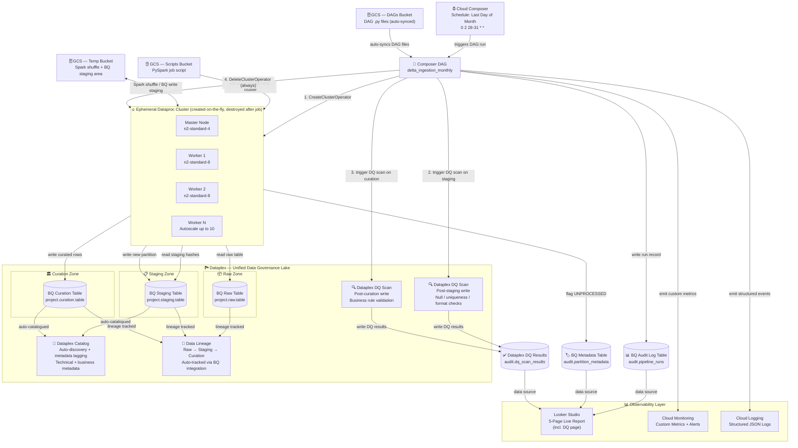

---

### 🏞️ Dataplex Governance Architecture

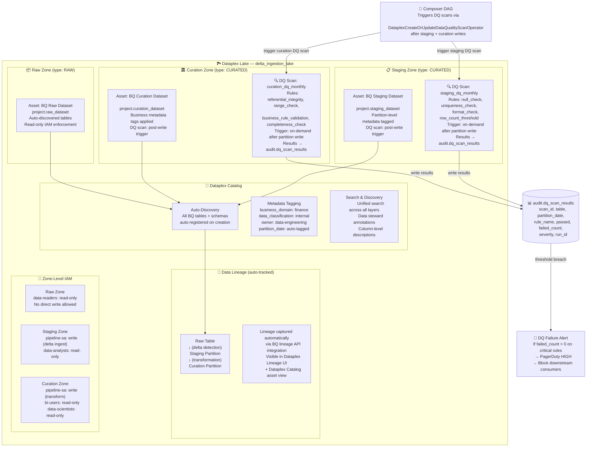

---

```mermaid
flowchart TD
    A([" ⏰ Composer Cron Trigger
    0 2 28-31 * *
    Runs daily, skips non-month-end days"]) --> B

    B["validate_is_last_day
    PythonOperator

    Checks if today is the last calendar day
    of the current month.
    Raises AirflowSkipException if not."]

    B --> C["check_raw_data_exists
    BigQuerySensor

    Waits until new rows are present
    in the Raw table for today's date.
    Timeout: 3600s | Poke interval: 120s"]

    C --> D["create_dataproc_cluster
    DataprocCreateClusterOperator

    Cluster name includes run date for uniqueness.
    Master: n2-standard-4 (1 node)
    Workers: n2-standard-8 (2–10, autoscale)
    Secondary workers: Preemptible (cost saving)
    Image: 2.1-debian12 with Spark 3.4"]

    D --> E{Cluster
    Created OK?}

    E -->|Fail| F["cluster_create_failed
    PythonOperator

    Alert via PagerDuty (CRITICAL).
    Update metadata status = CLUSTER_FAILED.
    Raise AirflowException."]

    F --> FAIL(["❌ DAG Failed — Cluster not created"])

    E -->|Success| G["log_cluster_ready
    PythonOperator

    Emit structured log event:
    cluster_created, worker_count,
    estimated runtime, run_id"]

    G --> H["submit_spark_delta_job
    DataprocSubmitJobOperator

    Submits PySpark script from GCS.
    Passes: project, raw_table, stg_table,
    cur_table, meta_table, run_date, run_id,
    temp_bucket as job arguments."]

    H --> I

    subgraph SPARK_JOB["⚙️ PySpark Job  —  Running inside Dataproc Cluster"]
        I["Step 1 — Read Raw Table
        BQ Connector reads raw table
        filtered to today's ingestion_date partition"]

        I --> J["Step 2 — Compute Row Hashes on Raw
        SHA256 hash of all value columns
        concatenated with a delimiter
        → adds row_hash column to raw DataFrame"]

        J --> K["Step 3 — Read Staging Hashes
        BQ Connector reads staging table
        selects PK + row_hash columns only
        (lightweight — no full table scan)"]

        K --> L["Step 4 — Detect NEW Rows
        Left Anti Join: raw vs staging on PK
        Rows present in raw but absent in staging
        → tagged _delta_type = 'NEW'"]

        L --> M["Step 5 — Detect CHANGED Rows
        Inner Join on PK
        Filter: raw.row_hash != staging.row_hash
        → tagged _delta_type = 'CHANGED'"]

        M --> N["Step 6 — Union Delta Records
        Combine NEW + CHANGED into delta_df
        Add: _ingested_at, _partition_date, _run_id"]

        N --> O{delta_df
        count > 0?}

        O -->|No| P["Write NO_DELTA status to Metadata.
        Log event: no_delta_found.
        Exit cleanly — job succeeds."]

        O -->|Yes| Q["Step 7 — Write to Staging Partition
        BQ Connector writes delta_df
        to staging table as a new DATE partition
        Mode: APPEND
        Partition field: ingestion_date"]

        Q --> R["Step 8 — Flag Partition UNPROCESSED
        Write row to audit.partition_metadata:
        partition_id, date, table_name,
        status = UNPROCESSED, row_count, run_id"]

        R --> S["Step 9 — Apply Transformation Logic
        Spark SQL reads the new staging partition.
        Applies business rules: clean, derive,
        enrich, normalise columns → curated_df"]

        S --> T["Step 10 — Write to Curation Layer
        BQ Connector writes curated_df
        to curation table as a new DATE partition
        Mode: OVERWRITE for the partition"]

        T --> U["Step 11 — Mark Partition PROCESSED
        Update audit.partition_metadata:
        status = PROCESSED, processed_at = now
        Emit structured completion log"]
    end

    U --> V["validate_staging_write
    BigQueryCheckOperator

    SELECT COUNT(*) > 0 FROM staging
    WHERE _PARTITIONDATE = run_date
    Fails DAG if count = 0"]

    V --> V2["trigger_dataplex_staging_dq_scan
    DataplexCreateOrUpdateDataQualityScanOperator

    Triggers Dataplex DQ scan on the new staging partition.
    Rules: null_check, uniqueness on PK, format_check,
    row_count_threshold (min rows > 0).
    Waits for scan completion via sensor.
    Writes results to audit.dq_scan_results."]

    V2 --> V3{DQ Scan
    Passed?}

    V3 -->|Fail — Critical Rules| V4["dataplex_dq_staging_failed
    PythonOperator

    Alert PagerDuty (HIGH).
    Update metadata: status = DQ_FAILED.
    Downstream consumers blocked.
    DAG proceeds to cluster delete (all_done)."]

    V3 -->|Pass or Warn only| W["delete_dataproc_cluster
    DataprocDeleteClusterOperator

    trigger_rule = all_done
    Cluster is ALWAYS destroyed —
    even if Spark job or validation failed.
    Zero idle compute cost guaranteed."]

    V4 --> W

    W --> W2["trigger_dataplex_curation_dq_scan
    DataplexCreateOrUpdateDataQualityScanOperator

    Triggers DQ scan on the new curation partition.
    Rules: referential_integrity, range_check,
    business_rule_validation, completeness_check.
    Results written to audit.dq_scan_results."]

    W2 --> X["write_audit_log
    BigQueryInsertJobOperator

    Inserts row into audit.pipeline_runs:
    run_id, dag_id, cluster_name, run_date,
    rows_raw, rows_delta, rows_curated,
    new_rows, changed_rows, duration_secs,
    dq_staging_status, dq_curation_status, status"]

    X --> Y["notify_completion
    PythonOperator

    Emit custom metrics to Cloud Monitoring.
    Send Slack / PagerDuty notification.
    Looker Studio dashboard refreshes
    automatically from BQ audit tables
    including Dataplex DQ results page."]

    Y --> Z(["✅ DAG Complete
    Cluster deleted — costs zeroed
    DQ results published to dashboard"])
```

---

### 📊 Observability Dashboard Architecture

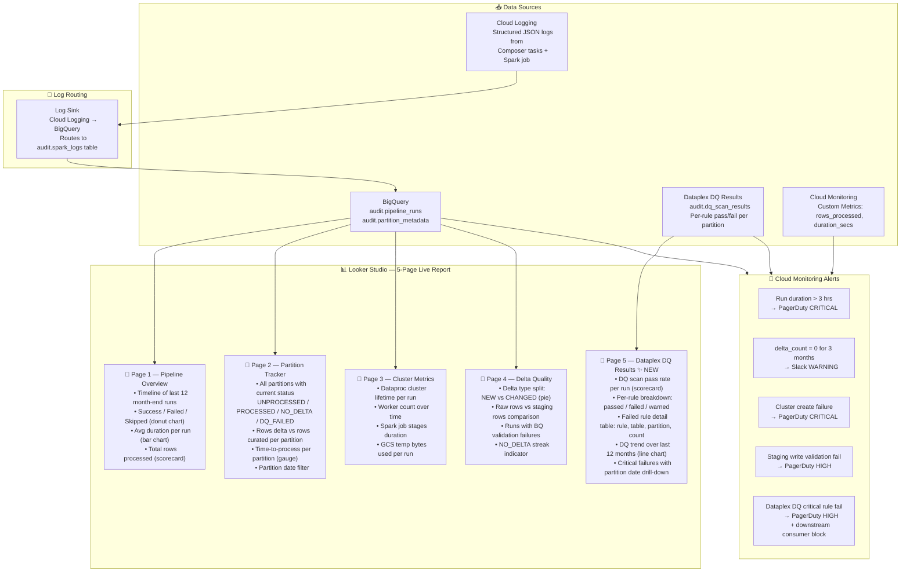

---

### 🧩 Component List

| Component | GCP Service | Purpose | Config Detail |
|-----------|-------------|---------|---------------|
| **Cloud Composer 2** | Cloud Composer | DAG scheduling + full lifecycle orchestration | `composer-2-medium`; schedule `0 2 28-31 * *` |
| **Last-Day Validator** | PythonOperator (Airflow) | Skip non-month-end runs automatically | Uses `calendar.monthrange()` + `AirflowSkipException` |
| **BigQuerySensor** | Airflow Sensor | Wait for raw data to be available before proceeding | Polls raw table; `poke_interval=120s`, `timeout=3600s` |
| **DataprocCreateClusterOperator** | Airflow Operator | Spin up ephemeral Dataproc cluster on demand | Cluster name includes run date for uniqueness |
| **Ephemeral Dataproc Cluster** | Cloud Dataproc | Execute PySpark delta job; created per run, destroyed after | `n2-standard-8` workers, 2–10 autoscale, preemptible secondary |
| **Dataproc Autoscaling Policy** | Cloud Dataproc | Dynamically adjust worker count based on YARN queue depth | `scaleUpFactor=1.0`, `scaleDownFactor=1.0`, min=2, max=10 |
| **DataprocSubmitJobOperator** | Airflow Operator | Submit PySpark script with all runtime arguments | Async with polling; injects project, tables, dates, run_id |
| **PySpark Delta Script** | GCS → Dataproc | Core logic: read BQ raw, hash compare, detect delta, write | SHA256 via `sha2(concat_ws(...))` DataFrame API |
| **Spark-BQ Connector** | BigQuery Connector for Spark | Read and write BigQuery tables from Spark workers | `spark-bigquery-with-dependencies_2.12` JAR |
| **GCS Scripts Bucket** | Cloud Storage | Versioned storage for PySpark job script | `gs://bucket/spark/delta_ingest_spark.py` |
| **GCS Temp Bucket** | Cloud Storage | Spark shuffle spill + intermediate BQ write staging | Lifecycle rule: auto-delete after 7 days |
| **DataprocDeleteClusterOperator** | Airflow Operator | Destroy cluster post-run (`trigger_rule=all_done`) | Guaranteed deletion even if Spark job failed |
| **BigQueryCheckOperator** | Airflow Operator | Validate staging partition was written before proceeding | Fails DAG if `COUNT(*) = 0` for the run date partition |
| **BQ Raw Table** | BigQuery | Source of truth; append-only ingestion layer | Partitioned by `ingestion_date`, clustered by PK |
| **BQ Staging Table** | BigQuery | Delta-detected records; one new partition per run | Same schema as Raw; partitioned by `ingestion_date` |
| **BQ Curation Table** | BigQuery | Transformed, business-ready analytical data | Partitioned by `event_date`; enriched schema |
| **BQ Metadata Table** | BigQuery | Partition lifecycle tracking (UNPROCESSED → PROCESSED → DQ_FAILED) | `audit.partition_metadata`; partitioned by `partition_date` |
| **BQ Audit Log Table** | BigQuery | Full pipeline run history; feeds the dashboard | `audit.pipeline_runs`; partitioned by `run_date` |
| **BQ Spark Logs Table** | BigQuery | Structured Spark job logs ingested via Log Sink | `audit.spark_logs`; populated by Cloud Logging sink |
| **Dataplex Lake** | Cloud Dataplex | Top-level logical container for all three data layers | `delta_ingestion_lake`; single lake per GCP project |
| **Dataplex Raw Zone** | Cloud Dataplex | Logical zone wrapping BQ raw dataset; enforces read-only access | Zone type: `RAW`; asset: `project.raw_dataset` |
| **Dataplex Staging Zone** | Cloud Dataplex | Logical zone wrapping BQ staging dataset; DQ scan triggered post-write | Zone type: `CURATED`; asset: `project.staging_dataset` |
| **Dataplex Curation Zone** | Cloud Dataplex | Logical zone wrapping BQ curation dataset; DQ scan triggered post-write | Zone type: `CURATED`; asset: `project.curation_dataset` |
| **Dataplex DQ Scan — Staging** | Cloud Dataplex | Automated data quality checks on newly written staging partition | Rules: null_check, uniqueness on PK, format_check, row_count_threshold |
| **Dataplex DQ Scan — Curation** | Cloud Dataplex | Automated data quality checks on newly written curation partition | Rules: referential_integrity, range_check, business_rule_validation, completeness_check |
| **DataplexCreateOrUpdateDataQualityScanOperator** | Airflow Operator | Trigger Dataplex DQ scans from Composer DAG after each write | Triggered twice per run: after staging write + after curation write |
| **Dataplex DQ Results Table** | BigQuery | Stores per-rule DQ scan results for every partition | `audit.dq_scan_results`; feeds Looker Studio DQ page + alerting |
| **Dataplex Catalog** | Cloud Dataplex | Auto-discovers and registers all BQ table schemas and metadata | Tags: `business_domain`, `data_classification`, `owner`, `partition_date` |
| **Dataplex Data Lineage** | Cloud Dataplex | End-to-end lineage tracking: Raw → Staging → Curation | Auto-captured via BQ lineage API; visible in Dataplex UI + Catalog |
| **Dataplex Zone-Level IAM** | Cloud Dataplex | Unified access control enforced at zone level, not per table | Raw: read-only; Staging: pipeline-sa write; Curation: BI/analytics read |
| **Cloud Logging Log Sink** | Cloud Logging | Route structured Spark + Composer logs into BigQuery | Sink filter: `labels.run_id` → `audit_dataset` |
| **Cloud Monitoring** | Cloud Monitoring | Custom metrics + threshold-based alerting (incl. DQ failures) | `delta_pipeline/rows_processed`, `delta_pipeline/dq_failed_rules` |
| **Looker Studio Dashboard** | Looker Studio | 5-page live observability report including Dataplex DQ results | Data source: `audit.*` tables including `dq_scan_results` |
| **PagerDuty / Slack** | External (via Composer callbacks) | Critical failure and DQ rule breach notifications | `on_failure_callback` in DAG default_args; DQ threshold alert |
| **Secret Manager** | Secret Manager | Store BQ service account keys, Slack webhook URL | Accessed by Composer via Airflow GCP secret backend |

---

### ✅ Pros & ❌ Cons

| | Detail |
|--|--------|
| ✅ **Zero Idle Compute Cost** | Dataproc cluster exists only for job duration (~60–90 min/month) — no 24/7 cluster charge |
| ✅ **Full Orchestration** | Composer manages scheduling, retries, cluster lifecycle, DQ scans, validation, and audit in a single DAG |
| ✅ **Ephemeral = Clean State** | Each run gets a fresh cluster — no state pollution, no dependency version drift between runs |
| ✅ **Autoscaling Workers** | Dataproc autoscaling policy adjusts worker count dynamically based on YARN pending resources |
| ✅ **Preemptible Secondary Workers** | 60–80% compute cost reduction using preemptible VMs for secondary worker nodes |
| ✅ **Spark-Native Delta Detection** | Left Anti Join + SHA256 hash via PySpark DataFrame API — handles 100 GB–10 TB+ |
| ✅ **Cluster Always Deleted** | `trigger_rule=all_done` on DeleteClusterOperator guarantees no zombie clusters on failure |
| ✅ **Automated Data Quality** | Dataplex DQ scans run after every staging and curation write — no manual quality checks needed |
| ✅ **Unified Data Governance** | Dataplex Lake + Zones enforce consistent IAM, discovery, and access control across all three BQ layers |
| ✅ **Automatic Data Lineage** | Raw → Staging → Curation lineage tracked automatically via Dataplex + BQ lineage API integration |
| ✅ **Metadata Catalog** | All BQ tables auto-registered in Dataplex Catalog with business tags — enables data discovery across teams |
| ✅ **Zone-Level IAM** | Access policies set at the Dataplex zone level, not per table — simplifies governance at scale |
| ✅ **Live Observability Dashboard** | 5-page Looker Studio report backed by BQ audit + Dataplex DQ results — no manual log digging |
| ✅ **Month-End Pattern** | Ideal for regulatory, financial, and compliance pipelines requiring last-day-of-month execution |
| ❌ **Cluster Startup Latency** | 3–6 min Dataproc spin-up makes this unsuitable for sub-hour or latency-sensitive workloads |
| ❌ **Composer Always-On Cost** | Composer 2 environment costs ~$300–800/month regardless of how often the DAG actually runs |
| ❌ **Dataplex DQ Scan Latency** | Each DQ scan adds 5–15 min to total pipeline duration depending on partition size and rule complexity |
| ❌ **Dataplex Setup Overhead** | Initial Lake, Zone, Asset, and DQ rule configuration requires upfront planning per table |
| ❌ **Spark-BQ Connector GCS Hop** | BQ writes from Spark require an intermediate GCS temp bucket — minor additional cost and step |
| ❌ **Spark + Dataplex + Dataproc Expertise** | Requires knowledge across PySpark, Dataproc, Dataplex DQ rules, and BQ connector tuning |
| ❌ **Not for Sub-Hour Schedules** | Cluster spin-up + DQ scan overhead makes per-run fixed cost too high for frequent small batches |

---

---

## Comparison Report

<div align="center">

### 📊 Approach vs. Criteria — Full Comparison Matrix

</div>

### Core Criteria

| Criterion | BQ Native SQL | Dataflow (Beam) | Cloud Composer | Cloud Functions | Dataproc (Spark) | **Composer + Ephemeral Dataproc** |
|-----------|:---:|:---:|:---:|:---:|:---:|:---:|
| **Implementation Complexity** | 🟢 Low | 🟡 Medium | 🟡 Medium | 🟢 Low | 🔴 High | 🟡 Medium |
| **Operational Overhead** | 🟢 Low | 🟡 Medium | 🔴 High | 🟢 Low | 🔴 High | 🟡 Medium |
| **Scalability** | 🟡 Medium | 🟢 High | 🟢 High | 🟡 Medium | 🟢 High | 🟢 High |
| **Cost at Scale** | 🟢 Low | 🟡 Medium | 🔴 High | 🟢 Low | 🟡 Medium | 🟢 Low (ephemeral cluster) |
| **Streaming Support** | ❌ No | ✅ Yes | ⚠️ Via Dataflow | ⚠️ Limited | ❌ No | ❌ No |
| **Orchestration Built-in** | ❌ No | ❌ No | ✅ Yes | ❌ No | ❌ No | ✅ Yes (Composer) |
| **Monitoring & Observability** | 🟡 Partial | 🟢 High | 🟢 High | 🟡 Medium | 🟡 Medium | 🟢 High (Looker Dashboard) |
| **Native BQ Integration** | 🟢 Native | 🟡 SDK | 🟢 Native | 🟢 Native | 🟡 Via Connector | 🟡 Via Connector |
| **Partition-Aware Ingestion** | ✅ Yes | ✅ Yes | ✅ Yes | ⚠️ Partial | ✅ Yes | ✅ Yes |
| **Latency** | 5–30 min | ~1–2 min | 5–30 min | 5–15 min | 10–30 min | 15–40 min (incl. cluster boot) |
| **Min Data Volume** | Any | Any | Any | < 10 GB | > 50 GB | > 10 GB |
| **Max Data Volume** | < 500 GB | Unlimited | Unlimited | < 10 GB | Unlimited | Unlimited |
| **Ephemeral Compute** | ✅ Serverless | ✅ Managed | ❌ Always-on | ✅ Serverless | ❌ Cluster persists | ✅ On-demand cluster |
| **Dashboard / Observability** | ❌ Manual | ⚠️ Dataflow UI only | ⚠️ Airflow UI only | ❌ Manual | ❌ Spark UI only | ✅ Looker Studio (5-page + DQ) |
| **Data Governance / Catalog** | ❌ None | ❌ None | ❌ None | ❌ None | ❌ None | ✅ Dataplex Lake + Catalog |
| **Automated DQ Scans** | ❌ None | ❌ None | ❌ None | ❌ None | ❌ None | ✅ Dataplex DQ (staging + curation) |
| **Data Lineage** | ❌ None | ❌ None | ❌ None | ❌ None | ❌ None | ✅ Dataplex auto-lineage |

### Delta Detection Capability

| Delta Method | BQ Native SQL | Dataflow (Beam) | Cloud Composer | Cloud Functions | Dataproc (Spark) | **Composer + Ephemeral Dataproc** |
|-------------|:---:|:---:|:---:|:---:|:---:|:---:|
| **EXCEPT ALL** | ✅ Native | ⚠️ Custom DoFn | ✅ via Operator | ✅ via BQ Job | ✅ DataFrame | ✅ DataFrame |
| **SHA256 Hash** | ✅ Native | ✅ Best fit | ✅ via SQL Task | ✅ via BQ Job | ✅ sha2() fn | ✅ sha2() PySpark |
| **PK + Hash Join** | ✅ Native | ✅ CoGroupByKey | ✅ via SQL Task | ✅ via BQ Job | ✅ Left Anti Join | ✅ Left Anti Join |
| **Watermark / Timestamp** | ✅ Native | ✅ Windowing | ✅ via Sensor | ✅ Event-driven | ✅ DataFrame filter | ✅ DataFrame filter |
| **CDC / Streaming** | ❌ | ✅ Yes | ✅ via Dataflow | ❌ | ❌ | ❌ |

### Cost Profile (Monthly Estimate)

| Scenario | BQ Native SQL | Dataflow | Cloud Composer | Cloud Functions | Dataproc | **Composer + Ephemeral Dataproc** |
|----------|:---:|:---:|:---:|:---:|:---:|:---:|
| **10 GB/day delta** | ~$5 | ~$20 | ~$350+ | ~$2 | ~$30 | ~$310 (Composer ~$300 + ~$10/run) |
| **100 GB/day delta** | ~$50 | ~$150 | ~$400+ | ⚠️ Timeout risk | ~$120 | ~$315 (cluster ~$15/run) |
| **1 TB/day delta** | ~$500 | ~$800 | ~$600+ | ❌ Not feasible | ~$400 | ~$320 (cluster ~$20/run) |
| **Month-end 1 TB (1× per month)** | ~$16 | ~$26 | ~$350+ | ❌ Not feasible | ~$13 | **~$313** (Composer idle + 1 ephemeral run) |
| **Idle cost** | $0 | $0 | ~$300 | $0 | $0 | ~$300 (Composer only) |

> *Composer + Ephemeral Dataproc is most cost-effective for month-end-only workloads. Dataproc cluster cost is near-zero (one 60–90 min run/month). Dominant cost is the always-on Composer environment.*

> *All estimates approximate. Actual costs depend on region, slot reservations, and worker configuration.*

### Recommended Use Case Matrix

| Your Scenario | Best Approach | Runner-Up |
|---------------|:---:|:---:|
| Simple nightly batch, < 100 GB | **BQ Native SQL** | Cloud Functions |
| Event-driven on file arrival | **Cloud Functions + BQ** | Cloud Composer |
| Streaming CDC, near real-time | **Dataflow (Beam)** | — |
| Complex multi-step enterprise pipeline | **Cloud Composer + BQ** | Composer + Dataflow |
| 500 GB+ batch, existing Spark team | **Dataproc** | Dataflow |
| Mixed: batch + stream | **Composer + Dataflow** | — |
| Minimal infra, max SQL | **BQ Native SQL + dbt** | — |
| **Month-end batch, Spark-native, full observability** | **Composer + Ephemeral Dataproc** | BQ Native SQL |
| **Large Spark job that must not leave a running cluster** | **Composer + Ephemeral Dataproc** | Dataproc Serverless |

### 🏆 Final Recommendation

```
For most production data engineering teams:

  PRIMARY STACK:
  ┌─────────────────────────────────────────────────────────────────┐
  │  Cloud Composer 2  +  BigQuery SQL Tasks  +  dbt Cloud / Core  │
  │                                                                 │
  │  Raw BQ Table                                                   │
  │    → [SHA256 Delta SQL via Airflow BQ Operator]                 │
  │    → Staging BQ Table (new date partition)                      │
  │    → [Metadata Flag: UNPROCESSED]                               │
  │    → [Airflow Partition Sensor]                                 │
  │    → [dbt model: staging → curation]                           │
  │    → Curation BQ Table                                          │
  │    → [Metadata Flag: PROCESSED + Audit Log]                     │
  └─────────────────────────────────────────────────────────────────┘

  SCALE-OUT:    Add Dataflow when any partition exceeds 200 GB

  LIGHTWEIGHT:  BQ Scheduled Queries + BQ Native SQL for < 50 GB daily

  EVENT-DRIVEN: Cloud Functions + Eventarc for file-arrival triggers

  ┌─────────────────────────────────────────────────────────────────┐
  │  MONTH-END BATCH  —  Approach 6 (with Dataplex)                 │
  │                                                                 │
  │  Cloud Composer 2  (last day of month, 02:00)                   │
  │    → validate_is_last_day  (skip non-month-end runs)            │
  │    → DataprocCreateClusterOperator  (ephemeral, autoscale 2–10) │
  │    → DataprocSubmitJobOperator                                  │
  │        PySpark: SHA256 hash compare  Raw vs Staging             │
  │        → Left Anti Join  →  NEW rows                           │
  │        → Inner Join hash mismatch  →  CHANGED rows             │
  │        → Write delta to Staging partition  (new DATE partition) │
  │        → Flag UNPROCESSED in audit.partition_metadata           │
  │        → Apply transformation  →  Write to Curation layer      │
  │        → Mark PROCESSED + emit structured JSON logs             │
  │    → Dataplex DQ Scan (staging)  — null, uniqueness, format     │
  │    → Dataplex DQ Scan (curation) — referential, business rules  │
  │    → DataprocDeleteClusterOperator  (trigger_rule=all_done)     │
  │    → Insert into audit.pipeline_runs + audit.dq_scan_results    │
  │    → Looker Studio 5-page dashboard auto-refreshes              │
  │                                                                 │
  │  Dataplex provides across all 3 BQ layers:                      │
  │    Lake / Zone / Asset organisation                             │
  │    Automated metadata catalog + business tagging               │
  │    End-to-end data lineage  (Raw → Staging → Curation)         │
  │    Zone-level IAM  (replaces per-table access policies)        │
  │    DQ scan results surfaced in dashboard Page 5                │
  │                                                                 │
  │  Dataproc cost ≈ $10–20/month  (one 60–90 min run only)         │
  │  Full observability via 5-page Looker Studio report             │
  └─────────────────────────────────────────────────────────────────┘

  MICROSERVICE:   Cloud Run when you need custom binaries, dbt CLI inline,
                  longer execution, or independent deployable services
```

---

*Report v4 — March 2026 | Author: Solution Architecture | Platform: Google Cloud Platform*
*v4 adds: Approach 6 — Composer + Ephemeral Dataproc + PySpark + Dataplex Governance + Observability Dashboard*
