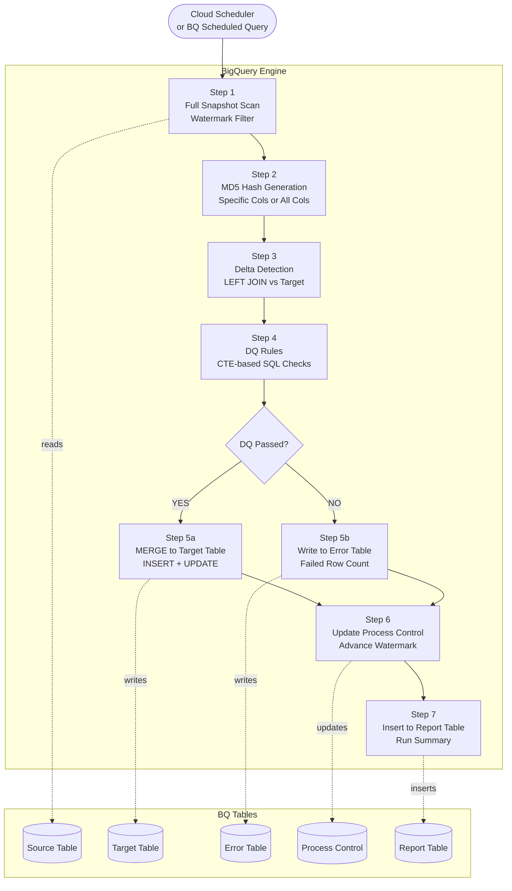
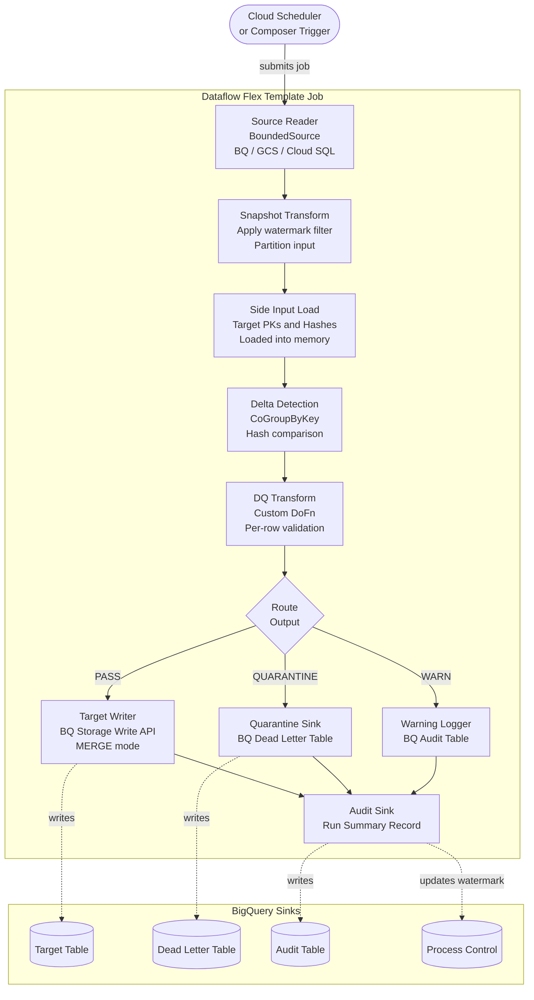
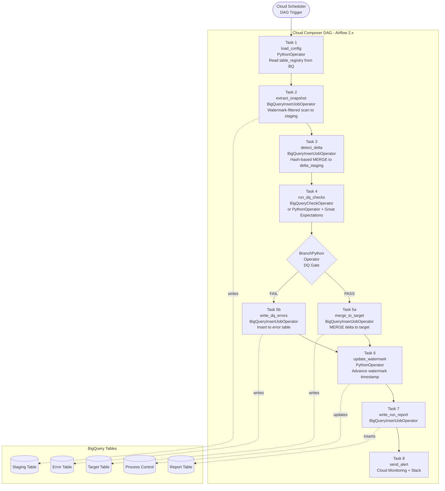
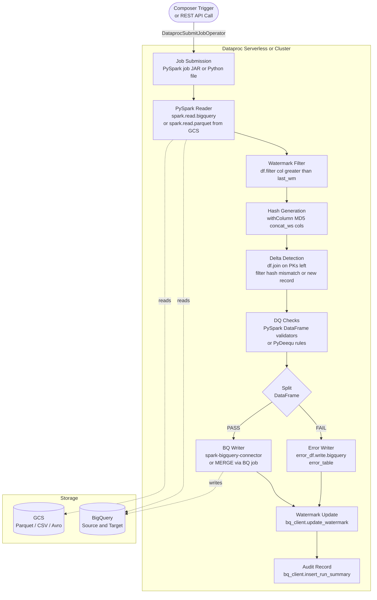
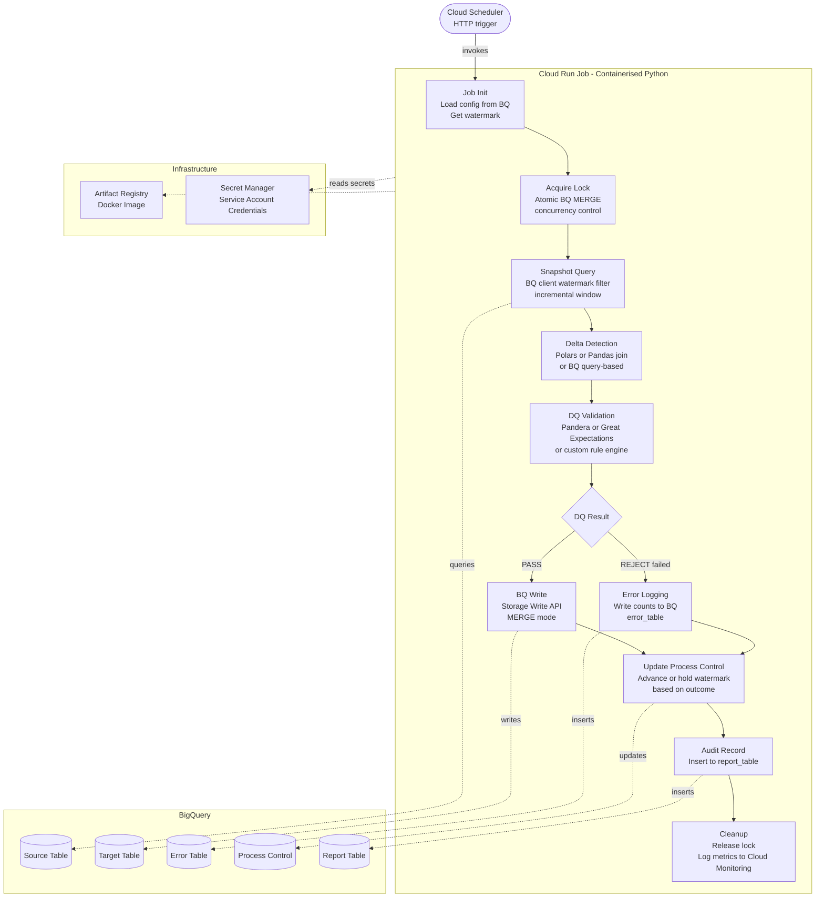
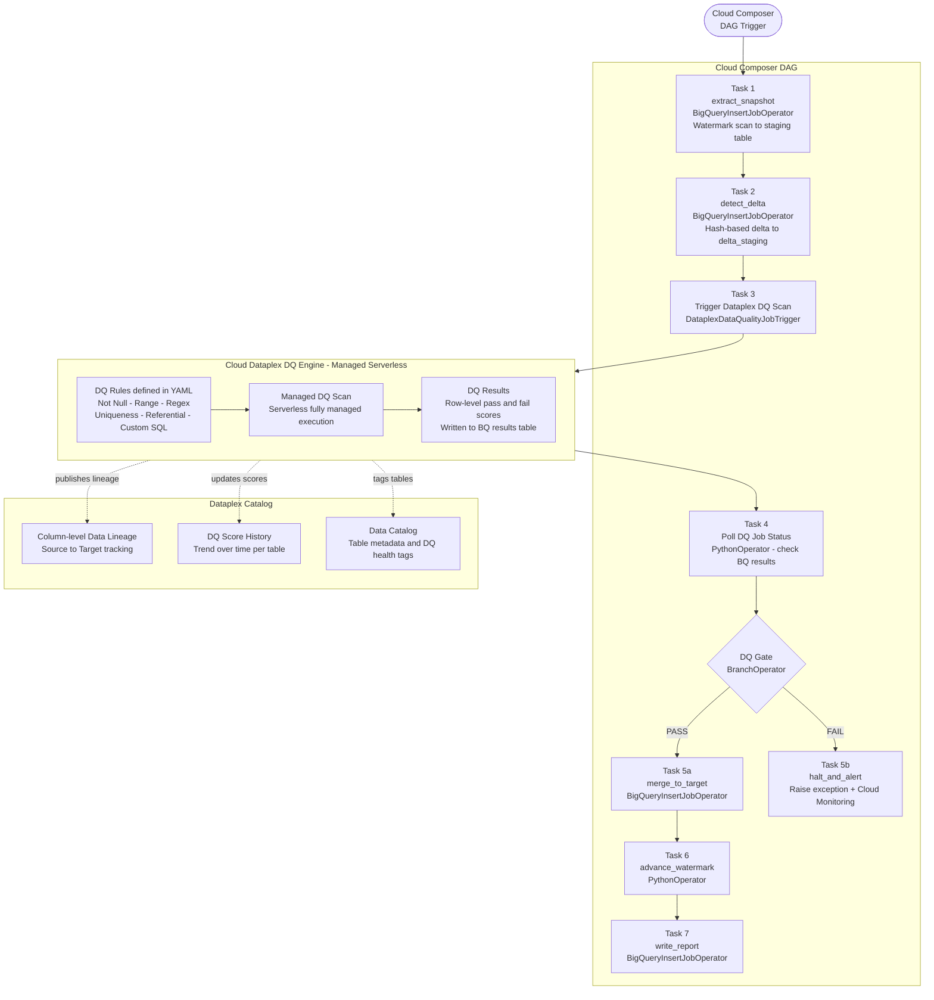
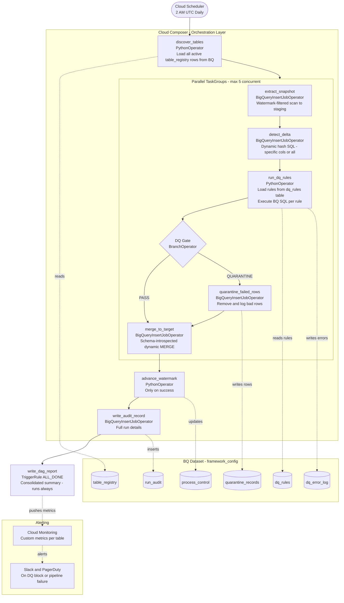

# GCP Batch Delta Ingestion — Architecture Compendium

> **Pattern:** Full Snapshot Scan → Delta Detection → DQ Check → Selective Ingestion  
> **Scope:** All viable GCP-native approaches with architecture diagrams, trade-offs, and decision guidance

---

## Table of Contents

| # | Solution | Best For |
|---|---|---|
| [01](#option-1--pure-bigquery-sql--scheduled-queries) | Pure BigQuery SQL + Scheduled Queries | Fast delivery, SQL-first teams |
| [02](#option-2--cloud-dataflow-apache-beam) | Cloud Dataflow (Apache Beam) | Non-BQ sources, TB+ scale |
| [03](#option-3--cloud-composer--bigquery-operators) | Cloud Composer + BigQuery Operators | Multi-step DAG, enterprise orchestration |
| [04](#option-4--dataproc-pyspark--serverless) | Dataproc (PySpark / Serverless) | GCS source, Spark ecosystem |
| [05](#option-5--cloud-run-jobs) | Cloud Run Jobs | Medium scale, low cost, Python-first |
| [06](#option-6--bq--dataplex-dq-enterprise-governed) | BQ + Dataplex DQ | Enterprise governance, lineage, compliance |
| [★](#recommended-hybrid-architecture) | Recommended Hybrid | Most enterprise BQ-to-BQ scenarios |
| [⊞](#decision-matrix) | Decision Matrix | Quick comparison reference |

---

## Option 1 — Pure BigQuery SQL + Scheduled Queries

> Zero-infrastructure — all logic in SQL, scheduled natively in BigQuery

### Architecture

### How It Works

All logic lives inside a single BigQuery query chain using CTEs or chained `CREATE TEMP TABLE` statements. The pipeline runs entirely within BQ — no Python, no clusters. Cloud Scheduler or BQ Scheduled Queries triggers execution. BQ handles snapshot scan, hash generation, delta detection, DQ checks, MERGE, and audit writes in sequence.

### Pros and Cons

| ✅ Pros | ❌ Cons |
|---|---|
| Zero infrastructure — no clusters or environments | DQ logic is SQL-only — no ML or cross-system checks |
| Fastest time to production — days not weeks | Dynamic SQL via `EXECUTE IMMEDIATE` gets messy |
| Native BQ performance — petabyte-scale columnar | No unit testing framework for SQL procedures |
| Pay-per-query — no always-on cost | Limited error branching — IF/CASE chains only |
| Full SQL auditability in BQ Job History | Hard to version-control stored procedure bodies |
| BQ Scheduled Queries has built-in retry | No native row-level quarantine routing |

> **Best For:** Source is BigQuery, DQ rules are SQL-expressible, SQL-first team, fast delivery needed.

---

## Option 2 — Cloud Dataflow (Apache Beam)

> Managed distributed processing — best for non-BQ sources and complex DQ

### Architecture

### How It Works

A Flex Template (containerised Apache Beam job) is triggered per schedule. It reads the full snapshot using a `BoundedSource`, loads target hashes as a **side input**, then routes records through a DQ `DoFn` using `TaggedOutputs` before writing to appropriate sinks. All transforms are distributed across Dataflow workers with auto-scaling.

### Pros and Cons

| ✅ Pros | ❌ Cons |
|---|---|
| Best for non-BQ sources — GCS, Cloud SQL, Pub/Sub | Higher complexity — Beam programming model learning curve |
| True distributed processing — auto-scales to any volume | Startup latency — 2–5 minutes even for small datasets |
| Rich DQ — custom Python/Java DoFn, ML models, APIs | Per-worker-hour cost even for short jobs |
| Native dead-letter routing via TaggedOutputs | Overkill for BQ-to-BQ — native SQL is faster and cheaper |
| Exactly-once delivery guarantees | Side input memory limits for large target hash sets |
| Flex Templates portable across projects | Template images need building and pushing to Artifact Registry |

> **Best For:** Source is GCS/Cloud SQL/external API, dataset is TB+, DQ requires custom Python, multiple output sinks needed.

---

## Option 3 — Cloud Composer + BigQuery Operators

> Best orchestration — multi-step DAG with DQ gate, retries, SLA monitoring

### Architecture

### How It Works

Each pipeline step is a separate Airflow task connected by dependencies. `BranchPythonOperator` acts as a DQ gate — halting or routing based on DQ results. BigQuery does all heavy SQL work; Composer provides orchestration, retry logic, SLA monitoring, and enterprise alerting. XCom passes run summaries between tasks.

### Pros and Cons

| ✅ Pros | ❌ Cons |
|---|---|
| Best orchestration — full DAG, retries, SLAs, branching | Composer environment always-on cost ~$300–800/month |
| Native BQ integration via BigQueryOperator family | Complex dynamic DAGs slow Composer scheduler |
| Great Expectations via GreatExpectationsOperator | Steep learning curve for DAG patterns and XCom |
| Visual DAG monitoring — Airflow UI task-level status | Each task has 30–60s startup overhead |
| XCom for clean inter-task data passing | Not for real-time — batch scheduler only |
| Enterprise alerting — PagerDuty, Slack, email built-in | Worker resource limits for PythonOperator tasks |

> **Best For:** Multi-step pipeline with complex dependencies, enterprise monitoring needed, multiple teams sharing one orchestration platform.

---

## Option 4 — Dataproc (PySpark / Serverless)

> Distributed Spark processing — best for GCS-sourced large-scale data

### Architecture

### How It Works

PySpark job runs on Dataproc Serverless (recommended) or a standard cluster. Source data from GCS or BQ is read into DataFrames. Delta detection uses a DataFrame join with hash comparison. DQ is applied as column-level filter expressions or PyDeequ rules. Clean delta is written to BQ via the `spark-bigquery-connector`.

### Pros and Cons

| ✅ Pros | ❌ Cons |
|---|---|
| Best for GCS-sourced large data — Parquet/ORC/Avro | Startup time — even Serverless Spark takes 2–4 minutes |
| Full Spark ecosystem — PyDeequ, Spark ML, custom UDFs | Expensive for small jobs — minimum billing unit |
| Serverless Dataproc — no cluster management, pay-per-job | Cluster management for standard clusters — sizing, patching |
| Rich DataFrame API — complex delta logic in clean Python | spark-bigquery-connector writes slower than native BQ |
| Multi-format — Hive, Delta Lake, Iceberg natively | Memory-bound joins with large target hash sets |
| Familiar for data engineers — Spark is industry standard | Overengineered for BQ-to-BQ pipelines |

> **Best For:** Source data is on GCS (Parquet/CSV/Avro), very large dataset, team has Spark expertise, Hive/Iceberg ecosystem integration needed.

---

## Option 5 — Cloud Run Jobs

> Containerised Python batch — low-cost, fast iteration, medium-scale

### Architecture

### How It Works

A containerised Python application runs as a Cloud Run Job triggered by Cloud Scheduler. Uses the BQ Python client for queries and writes. DQ implemented via Pandera, Great Expectations, or custom rules in-memory. BQ Storage Write API handles efficient bulk writes. All state persisted to BQ between runs — fully stateless container.

### Pros and Cons

| ✅ Pros | ❌ Cons |
|---|---|
| Low cost — pay only for execution time | Memory-bound — 32GB max, not for TB+ datasets |
| Simple deployment — one Docker image, one Scheduler job | No distributed processing — single container |
| Full Python flexibility — any library for DQ or transforms | No built-in retry DAG — all-or-nothing retries |
| Fast cold start — seconds vs minutes for Dataflow | No visual pipeline view — no Airflow-style UI |
| Easy local development — run container locally for E2E test | Must push custom metrics to Cloud Monitoring manually |
| Secret Manager integration — credentials cleanly injected | Stateless — all state must persist to BQ/GCS between runs |

> **Best For:** Medium-scale BQ-to-BQ, Python-first team, low-cost requirement, fast iteration cycle.

---

## Option 6 — BQ + Dataplex DQ (Enterprise Governed)

> Full governance — lineage, DQ catalog, regulatory compliance built-in

### Architecture

### How It Works

Composer orchestrates the staging and MERGE steps. **Dataplex Data Quality** acts as the managed DQ engine — YAML-configured rules run serverlessly against the delta staging table. Results are stored in BQ and surfaced in Dataplex Catalog with lineage tracking and historical DQ scores. No DQ code to write or maintain.

### Pros and Cons

| ✅ Pros | ❌ Cons |
|---|---|
| Enterprise governance built-in — lineage, catalog, DQ scores | Async DQ — Composer must poll; adds 5–15 min latency |
| Zero DQ code — rules defined in YAML | Per-scan pricing can be significant for frequent small runs |
| Historical DQ trending — pass/fail scores over time | Complex cross-system checks require workarounds |
| Column-level lineage from source to target | Dataplex zone/lake/catalog setup adds complexity |
| Regulatory compliance ready — GDPR/CCPA audit trail | Dataplex samples by default — full scan needs explicit config |
| Managed scaling — DQ scans are fully serverless | GCP lock-in — Dataplex DQ rules are not portable |

> **Best For:** Enterprise platform with compliance requirements, data catalog, lineage, regulatory audit trail, and centralised DQ governance across teams.

---

## Recommended Hybrid Architecture

For most enterprise BQ-to-BQ delta ingestion requirements, the optimal pattern combines **Cloud Composer** for orchestration + **Python-generated BigQuery SQL** for processing + a **config-driven DQ rule engine** backed by BQ tables.

### Why This Pattern Wins

- **Composer** owns orchestration, retries, SLA alerts, parallelism control
- **Python** generates dynamic BQ SQL at runtime — no hardcoded column lists, works for any table schema
- **BQ** does all the heavy lifting — hash computation, delta joins, DQ checks, MERGE — at petabyte scale
- **Config tables** in BQ mean zero code changes to onboard a new table — just two SQL `INSERT` statements
- **Watermark only advances on success** — if anything fails, the next run reprocesses the same window

---

## Decision Matrix

### Legend

| Badge | Meaning |
|---|---|
| **BEST** | Ideal fit — recommended choice for this criteria |
| **GOOD** | Supported with standard setup |
| **POSSIBLE** | Works but with trade-offs or extra effort |
| **NO** | Not suited or requires significant workaround |

---

### Source Compatibility

| Criteria | Pure BQ SQL | Dataflow | Composer + BQ | Dataproc | Cloud Run Jobs | BQ + Dataplex |
|---|:---:|:---:|:---:|:---:|:---:|:---:|
| **BigQuery source** — native BQ-to-BQ | `BEST` | `GOOD` | `BEST` | `POSSIBLE` | `GOOD` | `BEST` |
| **GCS / External files** — Parquet, CSV, Avro | `NO` | `BEST` | `POSSIBLE` | `BEST` | `GOOD` | `NO` |
| **External DB / API** — Cloud SQL, Spanner, REST | `NO` | `BEST` | `POSSIBLE` | `GOOD` | `BEST` | `NO` |

### Delta Detection

| Criteria | Pure BQ SQL | Dataflow | Composer + BQ | Dataproc | Cloud Run Jobs | BQ + Dataplex |
|---|:---:|:---:|:---:|:---:|:---:|:---:|
| **Key-based delta** — insert/update by PK | `BEST` | `GOOD` | `BEST` | `GOOD` | `GOOD` | `BEST` |
| **Hash-based delta** — MD5 row fingerprint | `BEST` | `GOOD` | `BEST` | `GOOD` | `GOOD` | `GOOD` |
| **Complex delta logic** — multi-col, nested, fuzzy | `POSSIBLE` | `BEST` | `GOOD` | `BEST` | `GOOD` | `POSSIBLE` |

### Data Quality

| Criteria | Pure BQ SQL | Dataflow | Composer + BQ | Dataproc | Cloud Run Jobs | BQ + Dataplex |
|---|:---:|:---:|:---:|:---:|:---:|:---:|
| **Simple SQL DQ rules** — null, range, uniqueness | `BEST` | `POSSIBLE` | `BEST` | `POSSIBLE` | `GOOD` | `BEST` |
| **Complex DQ logic** — cross-field, referential, ML | `NO` | `BEST` | `GOOD` | `BEST` | `GOOD` | `POSSIBLE` |
| **DQ audit trail** — governed, catalogued | `POSSIBLE` | `POSSIBLE` | `POSSIBLE` | `NO` | `NO` | `BEST` |
| **Dead letter / quarantine** — route failed rows | `POSSIBLE` | `BEST` | `GOOD` | `GOOD` | `GOOD` | `GOOD` |

### Scale and Performance

| Criteria | Pure BQ SQL | Dataflow | Composer + BQ | Dataproc | Cloud Run Jobs | BQ + Dataplex |
|---|:---:|:---:|:---:|:---:|:---:|:---:|
| **Very large scale — TB+** | `BEST` | `BEST` | `POSSIBLE` | `BEST` | `NO` | `BEST` |
| **Medium scale — GB range** | `BEST` | `GOOD` | `BEST` | `POSSIBLE` | `BEST` | `BEST` |

### Operations and Orchestration

| Criteria | Pure BQ SQL | Dataflow | Composer + BQ | Dataproc | Cloud Run Jobs | BQ + Dataplex |
|---|:---:|:---:|:---:|:---:|:---:|:---:|
| **Multi-step orchestration** — complex DAG | `NO` | `POSSIBLE` | `BEST` | `POSSIBLE` | `POSSIBLE` | `GOOD` |
| **Retry and SLA alerting** — auto-retry, monitoring | `POSSIBLE` | `GOOD` | `BEST` | `POSSIBLE` | `GOOD` | `GOOD` |
| **Data lineage tracking** — column-level provenance | `NO` | `POSSIBLE` | `POSSIBLE` | `NO` | `NO` | `BEST` |

### Cost and Complexity

| Criteria | Pure BQ SQL | Dataflow | Composer + BQ | Dataproc | Cloud Run Jobs | BQ + Dataplex |
|---|:---:|:---:|:---:|:---:|:---:|:---:|
| **Operational overhead** — infra to manage | `BEST` | `GOOD` | `POSSIBLE` | `NO` | `BEST` | `GOOD` |
| **Cost efficiency** — pay-per-query vs always-on | `BEST` | `POSSIBLE` | `POSSIBLE` | `NO` | `BEST` | `POSSIBLE` |
| **Implementation speed** — time to production | `BEST` | `POSSIBLE` | `GOOD` | `POSSIBLE` | `BEST` | `GOOD` |
| **Unit testability** — framework test support | `NO` | `GOOD` | `BEST` | `GOOD` | `BEST` | `POSSIBLE` |
| **Regulatory compliance** — GDPR, CCPA, audit | `NO` | `POSSIBLE` | `POSSIBLE` | `NO` | `NO` | `BEST` |

---

### Quick Recommendation by Scenario

| Scenario | Recommended Solution |
|---|---|
| BQ-to-BQ · Simple DQ · Fast delivery | **Pure BQ SQL + Scheduled Queries** |
| BQ-to-BQ · Enterprise audit trail + lineage | **BQ + Dataplex DQ + Composer** |
| External source · Complex transforms · TB+ scale | **Dataflow + Composer orchestration** |
| GCS files · Large data · Spark ecosystem | **Serverless Dataproc + Composer** |
| Medium scale · Custom Python logic · Low cost | **Cloud Run Jobs + BQ Storage Write API** |
| Multi-step DAG · Mixed sources · SLA monitoring | **Cloud Composer + BQ Operators + DQ Gate** |

---

*All architecture diagrams use [Mermaid](https://mermaid.js.org/) — renders natively on GitHub, GitLab, and VS Code.*
